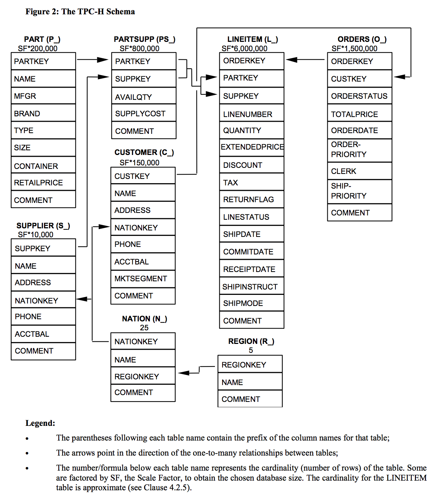

# TPC-H
 
 # TPC-H - Transaction Processing Performance Council

### TPC-H is a Decision Support Benchmark

> The TPC Benchmark™H (TPC-H) is a decision support benchmark. It consists of a 
suite of business oriented ad-hoc queries and concurrent data modifications. 
The queries and the data populating the database have been chosen to have broad 
industry-wide relevance. This benchmark illustrates decision support systems that
examine large volumes of data, execute queries with a high degree of complexity, 
and give answers to critical business questions. The performance metric reported 
by TPC-H is called the TPC-H Composite Query-per-Hour Performance Metric (QphH@Size), 
and reflects multiple aspects of the capability of the system to process queries. 
These aspects include the selected database size against which the queries are 
executed, the query processing power when queries are submitted by a single 
stream, and the query throughput when queries are submitted by multiple concurrent 
users. The TPC-H Price/Performance metric is expressed as $/QphH@Size.

O Schema é o seguinte




A especificação completa fica em [tpc-h_v2.17.3.pdf](tpc-h_v2.17.3.pdf)

## Preparando o TPC-H

```bash
# supondo que você abri o terminal na raiz desse projeto faça: 
cd TPC-H/TPC-H-2.17.3/dbgen
```

```bash
docker build -t parana/gcc .
# Para rodar com X11 use:
# docker run -it --rm -e DISPLAY -v /tmp/.X11-unix:/tmp/.X11-unix -v $PWD:/usr/app/build-dbgen parana/gcc bash
docker run -it --rm -v $PWD:/usr/app/build-dbgen parana/gcc bash
```

Dentro do contêiner executar:

```bash
cd /usr/app/build-dbgen
#  cmake -DCMAKE_CXX_COMPILER=g++ -DCMAKE_BUILD_TYPE=Release
make
./dbgen -h
```

Dentro do contêiner executar:

```bash
# To generate the SF=1 (1GB), validation database population, with customers, 
# orders and lineitems, use:
# ./dbgen -vf -s 1 -T c -T o 
# To generate the lineitem table only, for a scale factor 10 database,
# and over-write any existing flat files:
# ./dbgen -s 1 -f -T L
# To generate the SF=1 (1GB), validation database population, with customers, 
# orders and lineitems, use:
./dbgen -s 1 -T c
./dbgen -s 1 -T o 
wc *.tbl 
mv *.tbl DATA/
cd DATA
for i in `ls *.tbl`; do sed 's/|$//' $i > ${i/tbl/csv}; echo $i; done;
rm *.tbl
mv orders.csv order.csv ## todos os nomes de arquivos no singular
```

Agora temos todos os arquivos `.csv` no diretório prontos para serem lidos no Spark.

Selecionei 3 tabelas para a avaliação experimental. Inicialmente implementarei 
o dataflow equivalente a query13

Neste momento pode sair da sessão do contêiner

```bash
exit
```

Caso deseje fazer uma analise exploratória nos dados execute no computador host:

```bash
cd ..
amm
```

Copie o conteúdo do arquivo `spark-session.sc` para a shell do Ammonite e veja o resultado.
Isso pode ser feito comando a comando para verificar cada um dos comandos e respectivos resultados.

# Executáveis do TPC-H

Os executáveis foram gerados no Ubuntu 16 64 bits (via Docker). São eles:

```txt
dbgen/dbgen: ELF 64-bit LSB executable, x86-64, version 1 (SYSV)
dbgen/qgen: ELF 64-bit LSB executable, x86-64, version 1 (SYSV)
```

O software é acompanhado de Scripts executáveis também:

```txt
dbgen/tests/load_balance.sh: BASH Script
dbgen/tests/new55.sh: BASH Script
dbgen/tests/dop.sh: BASH Script
dbgen/tests/gen_tasks.sh: BASH Script
dbgen/tests/check_dirs.sh: BASH Script
dbgen/tests/last_row.sh: BASH Script
dbgen/tests/check55.sh: BASH Script
dbgen/check_answers/cmpq.pl: Perl script (text executable)
dbgen/check_answers/pairs.sh: BASH Script
dbgen/update_release.sh: BASH Script
dbgen/column_split.sh: BASH Script
dbgen/reference/trim_updates.sh: BASH Script
```


